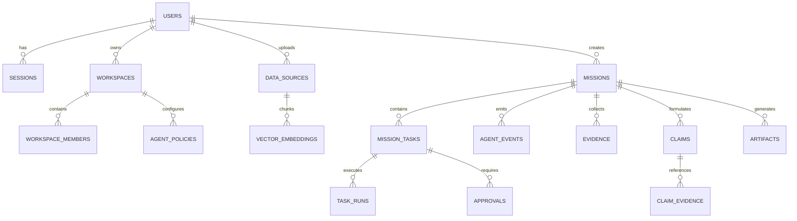

# TRACE — System Architecture & Codebase Structure

> Detailed technical specification of TRACE directory organization, database schema relationships, security guardrails, and agent execution mechanics.

---

## 📁 Repository Directory Structure

```text
trace/
├── backend/                       # Server-only runtime core & integrations
│   └── lib/
│       ├── agent/                 # Agent orchestration engine
│       │   ├── events.ts          # Sequence-checked event log appender
│       │   ├── memory.ts          # Long-term episodic memory & vector query
│       │   ├── policy-engine.ts   # Deterministic permission & risk gate
│       │   ├── replanner.ts       # Failure recovery & DAG replanning
│       │   ├── runtime.ts         # Mission DAG planner, step loop & synthesis
│       │   └── swarm.ts           # Multi-agent role collaboration (Architect, SafetyAudit)
│       ├── ai/                    # Multi-provider LLM integrations
│       │   ├── gemini.ts          # Google Gemini adapter (x-goog-api-key)
│       │   ├── groq.ts            # Groq Llama 3.3 70B adapter
│       │   ├── guard.ts           # AI Prompt Injection Defense Engine
│       │   └── provider.ts        # Provider abstraction & automatic failover
│       ├── tools/                 # Runtime capability registry
│       │   └── registry.ts        # 14 universal tools & VM sandbox execution
│       ├── api.ts                 # Unified API error handler wrapper
│       ├── auth.ts                # scrypt password hashing & session management
│       ├── db.ts                  # Neon Postgres connection singleton
│       ├── rate-limit.ts          # In-memory sliding window rate limiter
│       ├── sound.ts               # Web Audio API sound feedback
│       ├── utils.ts               # Shared classname merge utilities (cn)
│       └── vector.ts              # Hashed term vector embeddings & hybrid RAG
│
├── database/                      # Database migrations & initializers
│   └── init-db.mjs                # 15-table idempotent schema & indexes
│
├── frontend/                      # Next.js App Router (React 19, Tailwind CSS)
│   ├── src/
│   │   ├── app/                   # Route handlers & visual pages
│   │   │   ├── api/               # 24 RESTful API endpoint routes
│   │   │   │   ├── approvals/     # Approval list & resolution routes
│   │   │   │   ├── auth/          # Login, signup, me, logout, change-password
│   │   │   │   ├── data-sources/  # Upload, inventory & delete data sources
│   │   │   │   ├── health/        # Health check (DB latency & provider status)
│   │   │   │   ├── memories/      # Long-term memory query & storage
│   │   │   │   ├── missions/      # Mission start, step, stream, control, CRUD
│   │   │   │   ├── search/        # Unified global search endpoint
│   │   │   │   ├── settings/      # Workspace settings & provider preferences
│   │   │   │   ├── tools/         # Tool registry metadata API
│   │   │   │   ├── vector/        # Vector RAG search API
│   │   │   │   └── workspaces/    # Workspace members API
│   │   │   ├── app/               # Authenticated application shell
│   │   │   │   ├── approvals/     # Pending authorization requests page
│   │   │   │   ├── data/          # Data sources inventory page
│   │   │   │   ├── missions/[id]/ # Mission canvas, task DAG & artifact view
│   │   │   │   ├── new/           # Mission creation & template composer
│   │   │   │   ├── onboarding/    # Initial autonomy mode selector
│   │   │   │   ├── replay/        # Time-Travel Trajectory Replay Center
│   │   │   │   ├── settings/      # Workspace control plane & password change
│   │   │   │   ├── tools/         # Tool capability registry explorer
│   │   │   │   └── layout.tsx     # Sidebar nav, user context & ToastProvider
│   │   │   ├── login/             # User sign-in page
│   │   │   ├── signup/            # User registration page
│   │   │   ├── globals.css        # Tailwind v4 theme & CSS custom properties
│   │   │   ├── layout.tsx         # Root HTML shell & meta tags
│   │   │   ├── middleware.ts      # Route protection & security headers
│   │   │   └── page.tsx           # Public landing page & showcase hero
│   │   └── components/            # Reusable UI & interaction components
│   │       └── ui/
│   │           ├── ambient-3d-background.tsx     # Animated GPU canvas background
│   │           ├── artifact-exporter.tsx         # Markdown & JSON export component
│   │           ├── chart-renderer.tsx            # Bar, line, pie chart renderer
│   │           ├── command-palette.tsx           # Cmd+K quick navigation palette
│   │           ├── document-preview-modal.tsx    # Source file preview modal
│   │           ├── hold-to-confirm.tsx           # Press-and-hold authorization button
│   │           ├── interactive-task-graph.tsx    # SVG DAG visualization canvas
│   │           ├── logo.tsx                      # Vector brand mark
│   │           ├── scroll-locked-video-hero.tsx  # Showcase hero component
│   │           ├── time-travel-replay.tsx        # Event timeline scrubber
│   │           └── toast-provider.tsx            # Global toast notifications
│   ├── package.json
│   └── tsconfig.json
```

---

## 🗄️ Database Schema & Entity Relationships

TRACE uses **Neon PostgreSQL** with an idempotent 15-table schema:



### Key Tables Overview

| Table Name | Primary Key | Description |
| --- | --- | --- |
| `users` | `id` (UUID) | User identity, email, scrypt password hash, autonomy mode |
| `sessions` | `token` (TEXT) | Active session tokens with SHA-256 hash & 30-day expiry |
| `workspaces` | `id` (UUID) | Multi-tenant organization boundaries |
| `workspace_members` | `(workspace_id, user_id)` | Role-based membership (`owner`, `admin`, `member`) |
| `agent_policies` | `id` (UUID) | Workspace risk policy overrides per tool capability |
| `data_sources` | `id` (UUID) | Ground-truth user files (CSV, JSON, Markdown, Text) |
| `vector_embeddings` | `id` (UUID) | Indexed 64-dim term vector chunks (`source_id` FK) |
| `agent_memories` | `id` (UUID) | Episodic and semantic long-term agent memory |
| `missions` | `id` (UUID) | Investigation objectives, status, lease locks |
| `mission_tasks` | `id` (UUID) | DAG task nodes with dependency arrays & risk levels |
| `task_runs` | `id` (UUID) | Execution log records per task attempt |
| `tool_calls` | `id` (UUID) | Tool invocation logs with input/output payloads |
| `model_runs` | `id` (UUID) | LLM inference calls with prompt char & latency metrics |
| `evidence` | `id` (UUID) | Excerpts collected from data sources or tool outputs |
| `claims` | `id` (UUID) | Synthesized factual claims with confidence scores (0-1) |
| `claim_evidence` | `(claim_id, evidence_id)` | Evidence linkage graph (`supports` \| `contradicts`) |
| `approvals` | `id` (UUID) | Human-in-the-loop authorization requests |
| `artifacts` | `id` (UUID) | Final generated reports and documentation |
| `agent_events` | `id` (UUID) | Chronological sequence-checked event stream |

---

## ⚡ Agent Runtime Mechanics

The TRACE Agent Runtime in `backend/lib/agent/runtime.ts` operates via a **Serverless-Safe Step Loop**:

```text
1. Client triggers POST /api/missions/[id]/step
2. DB Lease Lock acquired (step_lease_until) to prevent concurrent executions
3. Evaluates all pending tasks in mission_tasks
4. Identifies "runnable" tasks whose dependencies (depends_on) are satisfied
5. Runs Policy Engine (evaluatePolicy) against user autonomy mode & workspace policies
6. If tool requires human authorization -> transitions task to waiting_approval
7. Safe tasks execute in parallel (Promise.allSettled)
8. Tool failures trigger LLM Self-Healing (generateJSON) to fix parameters
9. Unrecoverable failures trigger Dynamic Replanning (replanAfterFailure)
10. Once all tasks complete -> Executive Synthesis merges observations into Artifacts & Claims
11. Mission insights enter Agent Long-Term Memory (extractAndPersistMissionInsights)
12. DB Lease released
```

---

## 🔒 Security Architecture

1. **AI Prompt Injection Neutralization**:
   - `sanitizePromptInput` in `backend/lib/ai/guard.ts` scans all prompt inputs for adversarial injection patterns.
2. **Node `node:vm` Sandbox Execution**:
   - `executeCode` tool uses Node VM context (`vm.runInNewContext`) with safe built-ins only and a strict `1000ms` CPU execution timeout.
3. **Data Scoped Vector RAG**:
   - `hybridVectorSearch` accepts `userId` and filters queries via `WHERE d.user_id = ${userId}`, ensuring complete data isolation.
4. **Sliding-Window Rate Limiting**:
   - In-memory rate limiter in `backend/lib/rate-limit.ts` enforces limits on auth endpoints.
